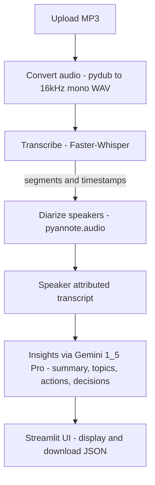

## 🎷 Smart Meeting Assistant — Your AI Meeting Co‑Pilot ✨

Turn raw meeting audio into clean transcripts, speaker‑attributed conversations, and instant insights — 📝 summaries, 🧩 topics, ✅ actions, and 🔦 decisions — all in one delightful Streamlit app.

---

### 🏷️ Badges


---

### 🗂️ Table of Contents

- [📖 Overview](#overview)
- [✨ Features](#features)
- [🧭 Architecture](#architecture)
- [🚀 Getting Started](#getting-started)
  - [🧩 Prerequisites](#prerequisites)
  - [🛠️ Installation](#installation)
  - [🔐 Environment Variables](#environment-variables)
  - [▶️ Run](#run)
- [🎮 Usage](#usage)
- [📸 Screenshots](#screenshots)
- [⚙️ Configuration](#configuration)
- [🧯 Troubleshooting](#troubleshooting)
- [🗺️ Roadmap](#roadmap)
- [🙏 Acknowledgments](#acknowledgments)

---

<a id="overview"></a>
### 📖 Overview

This app ingests a `.mp3` meeting recording 🎧, converts to high‑quality mono WAV 🎼, transcribes it locally with Faster‑Whisper 🗣️, diarizes speakers via Pyannote 🧑‍🤝‍🧑, and then uses Google Gemini 🧠 to synthesize insights: summaries, topics, actions, and key decisions.

---

<a id="features"></a>
### ✨ Features

- **🎧 Upload MP3**: Drag‑and‑drop in the sidebar.
- **🎼 Studio‑quality conversion**: Resampled to 16 kHz, mono, 16‑bit PCM.
- **🗣️ Accurate transcription**: Local Faster‑Whisper (`base`, CPU, int8).
- **🧑‍🤝‍🧑 Speaker diarization**: Segments assigned to speakers with timestamps.
- **🧠 Smart insights**: Gemini‑powered summary, topics, action items, decisions.
- **📤 Export**: Download speaker‑attributed transcript as JSON.
- **⚡ Streamlit UX**: Clean, responsive, fast.

---

<a id="architecture"></a>
### 🧭 Architecture



Key files 📂:

- `app.py`: Streamlit app and UI flow
- `utils/whisper_transcribe.py`: Faster‑Whisper transcription
- `utils/diarization.py`: Pyannote diarization and segment formatting
- `utils/gemini_utils.py`: Gemini prompts for insights
- `utils/audio_utils.py`: Conversion helpers

---

<a id="getting-started"></a>
### 🚀 Getting Started

<a id="prerequisites"></a>
#### 🧩 Prerequisites

- Python 3.10 (recommended)
- Windows 10+ (others may work; instructions below focus on Windows)
- FFmpeg (required by `pydub` to read `.mp3`)
  - Install via `choco install ffmpeg` (PowerShell, with Chocolatey), or download from the FFmpeg site and add to PATH.
- Hugging Face account and token with access to `pyannote/speaker-diarization`
- Google AI Studio API key for Gemini

<a id="installation"></a>
#### 🛠️ Installation

PowerShell (Windows) 💻:

```powershell
cd "C:\meeting summarizer"
python -m venv venv
./venv/Scripts/Activate.ps1
# Faster install (curated):
pip install --upgrade pip
pip install -r requirements2.txt
# If you need full stack:
# pip install -r requirements.txt
```

<a id="environment-variables"></a>
#### 🔐 Environment Variables

Set the following before running:

```powershell
$env:HF_TOKEN = "<your_huggingface_token>"           # access to pyannote/speaker-diarization
$env:GEMINI_KEY = "<your_gemini_api_key>"           # Google AI Studio API key
```

Notes 💡:

- In `utils/diarization.py`, the pipeline expects `HF_TOKEN` to be available. Export as above.
- In `utils/gemini_utils.py`, the client reads `GEMINI_KEY`.
- `app.py` configures local caches at runtime: `SPEECHBRAIN_CACHE`, `TRANSFORMERS_CACHE`, `HUGGINGFACE_HUB_CACHE`.

<a id="run"></a>
#### ▶️ Run

```powershell
streamlit run app.py
```

Open the local URL Streamlit prints (usually `http://localhost:8501`).

> Tip 💡: The first run may download model weights — subsequent runs are much faster thanks to local caches.

---

<a id="usage"></a>
### 🎮 Usage

1. 🎧 Upload a `.mp3` in the sidebar.
2. ⏳ Wait for conversion, transcription, and diarization to complete.
3. 🗣️ Expand the transcript to review per‑speaker text and timestamps.
4. 🧠 Click buttons to generate:
   - 📝 Summary
   - 🧩 Topics
   - ✅ Action Items
   - 🔦 Decisions
5. 📤 Click “Download as JSON” to save the transcript.

---

<a id="screenshots"></a>
### 📸 Screenshots

Add your own screenshots under a `docs/` folder and reference them here.


---

<a id="configuration"></a>
### ⚙️ Configuration

- Change Whisper model size or device in `utils/whisper_transcribe.py`:

```python
model = WhisperModel("base", device="cpu", compute_type="int8")
```

Options: `tiny`, `base`, `small`, `medium`, `large-v3` and `device`=`cpu` or `cuda` (if available). Larger models are slower but more accurate ⚖️.

- If diarization is slow, consider shorter inputs or chunking. The current pipeline uses:

```python
Pipeline.from_pretrained("pyannote/speaker-diarization", use_auth_token=HF_TOKEN)
```

Ensure your Hugging Face token has accepted the model’s license on its model page ✅.

---

<a id="troubleshooting"></a>
### 🧯 Troubleshooting

- ❗ FFmpeg not found: Ensure `ffmpeg` is on PATH (`ffmpeg -version`).
- 🔑 Pyannote authorization error: Confirm `$env:HF_TOKEN` is set and you accepted access on the model page.
- 🧱 Torch install issues on Windows: Use the curated `requirements2.txt` first; if CUDA is not installed, keep `device="cpu"`.
- 📊 Gemini quota or auth errors: Verify `$env:GEMINI_KEY` and project quota in Google AI Studio.
- 🐢 Long processing times: First run downloads models; subsequent runs use caches configured in `app.py`.

---

<a id="roadmap"></a>
### 🗺️ Roadmap

- 🌍 Multi‑language transcription and translation
- ✍️ Inline editing of transcripts and re‑summarization
- 🧭 Named‑entity detection (people, dates, projects)
- 📦 Export to Markdown, DOCX, and Notion
- 📚 Batch processing for multiple recordings

---

<a id="acknowledgments"></a>
### 🙏 Acknowledgments

- [Streamlit](https://streamlit.io/)
- [Faster‑Whisper](https://github.com/guillaumekln/faster-whisper)
- [pyannote.audio](https://github.com/pyannote/pyannote-audio)
- [Google Gemini API](https://ai.google.dev/)
- [pydub](https://github.com/jiaaro/pydub)

— Made with ❤️ to make your meetings productive again. 🎷


